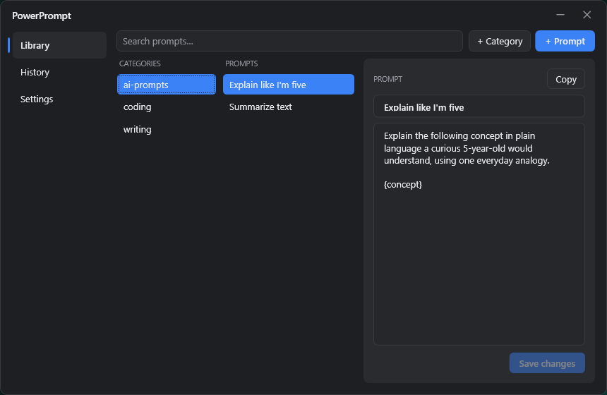

# PowerPrompt

A lightweight Windows system-tray app for **rewriting clipboard text** and **organizing your prompts** — fast, dark, and out of the way.



- **Quick Rewrite** — copy text, press a hotkey, pick *Correct spelling* / *Polish* / *Professionalize*, and the improved text replaces your clipboard. Runs your local [Claude Code](https://claude.com/claude-code) CLI; no API keys, no servers.
- **Prompt Library** — a keyboard-driven organizer for saved prompts: categories → prompts, search, and an editable preview pane. Find a prompt, press Enter, it's on your clipboard.

Plus a rewrite history log, editable templates, and optional git sync between your machines. Windows only (.NET 8 / WPF).

## Install

1. Download **`PowerPrompt.exe`** from the [Releases](../../releases) page and run it. It's an unsigned single-file app, so click **More info → Run anyway** if SmartScreen warns you.
2. A grey icon appears in your tray — left-click to open, right-click for the menu.

> **Quick Rewrite** needs the [`claude` CLI](https://claude.com/claude-code) installed and signed in (it uses your own Claude account). Settings shows whether it's detected. Everything else works without it.

## Usage

| Action | Default hotkey |
|---|---|
| Rewrite popup | `Ctrl+Alt+R` |
| Open / close Library | `Ctrl+Alt+L` |

Both are remappable in **Settings** (it warns you if a combo is already taken). In the Library, arrow keys navigate (`→`/`Enter` to drill in, `←` back) and **Enter copies a prompt**; the right pane lets you edit prompts in place. The app only ever *overwrites your clipboard* — it never auto-pastes, and never touches the clipboard if a rewrite fails.

## Sync between machines (optional)

Settings → Sync can push your library + templates to a **private git repo** (LibGit2Sharp, no `git.exe` needed). Create an empty private repo + a PAT, paste both into Settings, and **Link & Sync** — your other machine pulls them down. The token lives in Windows Credential Manager, never in a file. Leave it blank to stay fully local.

Data lives in `%APPDATA%\PowerPrompt\` (one JSON file per prompt).

## Uninstall

**Settings → Uninstall** cleanly removes the app, the startup entry, and the saved token (optionally your data too) — so nothing is left behind.

## Build from source

Requires the [.NET 8 SDK](https://dotnet.microsoft.com/download).

```powershell
dotnet publish src/PowerPrompt/PowerPrompt.csproj -c Release -r win-x64 `
  --self-contained true -p:PublishSingleFile=true -p:IncludeNativeLibrariesForSelfExtract=true
```

The single-file exe (self-contained, runs with no prerequisites) lands in `src/PowerPrompt/bin/Release/net8.0-windows/win-x64/publish/`.

## License

MIT — see [LICENSE](LICENSE).

---

<sub>Built with [Claude Code](https://claude.com/claude-code).</sub>
